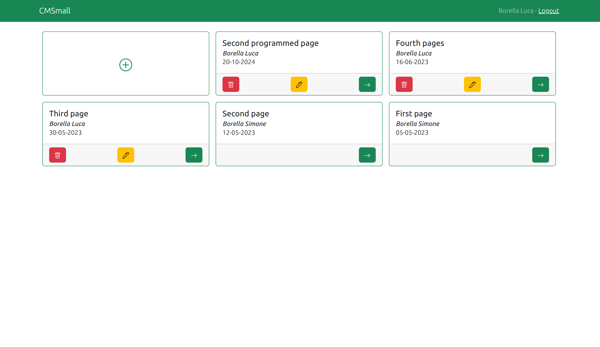
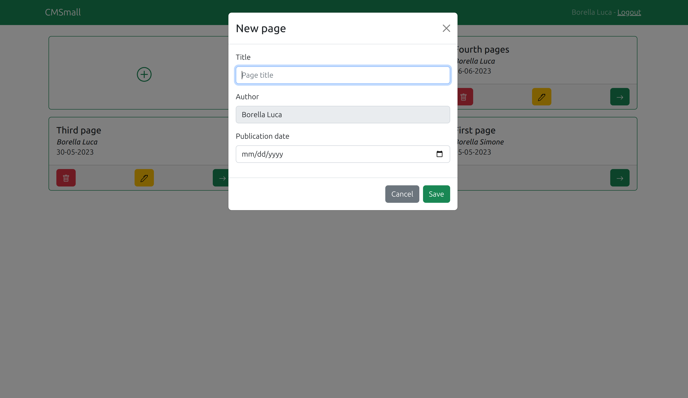

# webapp-cmsmall
Content manager web application final project for the Web Application course during academic year 2022/2023 in Politecnico di Torino.

# Server side

## API Server

- POST `/api/login`
  - request
    - parameters: none
    - body content: json {username, password} of the user
  - response body content: json {id, name, email, role} about the authenticated user
- POST `/api/logout`
  - request
    - parameters: none
    - body content: none
  - response body content: none
- GET `/api/websitename`
  - request
    - parameters: none
    - body content: none
  - response body content: json {name} with the name of the website
- GET `/api/pages`
  - request
    - parameters: none
    - body content: none
  - response body content: json [{title, author, creationDate, pubDate}], list of all pages
- GET `/api/pages/:pageId`
  - request
    - parameters: pageId, id of the page to retrieve
    - body content: none
  - response body content: json {title, author, creationDate, pubDate}
- GET `/api/pages/:pageId/contents`
  - request
    - parameters: pageId, id of the page containing contents to retrieve
    - body content: none
  - response body content: json [{id, type, value, sortOrder, pageId}], list of the contents in the specified page
- GET `/api/users`
  - request
    - parameters: none
    - body content: none
  - response body content: json [{email, name, role}], list of all users
- POST `/api/websitename`
  - request
    - parameters: none
    - body content: json {name} with the new website name
  - response body content: none
- POST `/api/pages`
  - request
    - parameters: none
    - body content: json {title, author, creationDate, pubDate}, page to add
  - response body content: json {lastId}, id of the created page
- PUT `/api/pages/:pageId`
  - request
    - parameters: pageId, id of the page to edit
    - body content: none
  - response body content: none
- DELETE `/api/pages/:pageId`
  - request
    - parameters: pageId, id of the page to delete
    - body content: none
  - response body content: none
- POST `/api/pages/:pageId/contents`
  - request
    - parameters: pageId, id of the page in which the content is created
    - body content: json {type, value, sortOrder, pageId}
  - response body content: none
- PUT `/api/contents/:contentId`
  - request
    - parameters: contentId, id of the content to edit
    - body content: json {type, value, sortOrder, pageId}
  - response body content: none
- DELETE `/api/contents/:contentId`
  - request
    - parameters: contentId, id of the content to delete
    - body content: none
  - response body content: none

## Database Tables

- Table `users` - contains id, email, name, role, salt, password
- Table `websitename` - contains id, name
- Table `pages` - contains id, title, author, creationDate, pubDate
- Table `contents` - contains id, type, value, sortOrder, pageId

# Client side

## React Client Application Routes

- Route `/`: show the list of all pages and allow enabled users to edit pages properties 
- Route `/pages/:pageId`: show the content of the page having  page id equal to the parameter pageId and allow enabled users to edit the page content
- Any other routes: page not found error

## Main React Components

- `MainLayout` (in `App.js`): define the main layout with the bar describing the website name and login/logout actions
- `LoginModal` (in `App.js`): component used in the main layout, define the form to perform login
- `EditNameModal` (in `App.js`): define the form to edit the website name

- `PageList` (in `PageList.js`): shows the pages the user is enabled to see and if authenticated allow him to create new pages, edit and delete existing pages
- `PagesGrid` (in `PageList.js`): shows the pages grid and the button to add a new page
- `AddPageModal` (in `PageList.js`): define the form to add a new page
- `EditPageModal` (in `PageList.js`): define the form to edit a page

- `PageContent` (in `PageContent.js`): shows the contents of a page and if the user is authenticated allow him to create new contents, sort, edit and delete existing contents
- `ContentList` (in `PageContent.js`): shows the content list
- `AddContentModal` (in `PageContent.js`): define the form to add a new content
- `EditContentModal` (in `PageContent.js`): define the form to edit a content
- `ContentForm` (in `PageContent.js`): used into the modals to put the content form based on the type selected
- `AddContentButton` (in `PageContent.js`): define the button to add a new page in a fixed place 
- `CenteredAlert` (in `PageContent.js`): define the alert message in a fixed place

- `CenteredSpinner` (in `CenteredSpinner.js`): waiting spinner at the center of the page

- `PageNotFound` (in `PageNotFound.js`): page not found alert

# Usage info

## Pages screenshot

## Add page screenshot

## Users Credentials

| User | Email | Password | Role |
|-----------|-----------|-----------|-----------|
| Borella Simone  | borellasimone00@gmail.com  | password  | Admin  |
| Borella Luca  | borellaluca97@gmail.com  | password  | User  |
| Borella Marco  | borellamarco64@gmail.com  | password  | User  |
| Muffone Marisa  | muffonemarisa67@gmail.com  | password  | User  |
